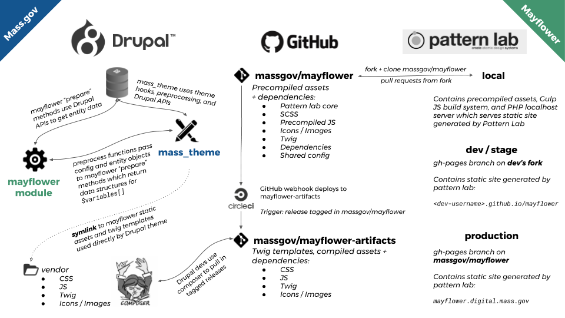

# Mayflower

[Mayflower](https://github.com/massgov/mayflower) is an open source Design System built in [Pattern Lab](http://patternlab.io/) (PHP) and maintained by Mass. Digital Services. Learn more about Mayflower in the [project's repo readme](https://github.com/massgov/mayflower).

## Mayflower and Mass.gov's Drupal theme

Mass.gov uses a custom Drupal theme, called [mass_theme](../docroot/themes/custom/mass_theme), which uses Mayflower build artifacts as a project dependency for static assets (css, js, and image) as well as twig templates.  

This relationship is managed alongside other project dependencies through composer.  Learn more about this relationship in the [Mayflower Artifacts](#mayflower-artifacts) section below.

Mass.gov also uses a custom Drupal module, called [mayflower](../docroot/modules/custom/mayflower), which acts as "glue code" to get `mass_theme` working with Mayflower.  Learn more in the [mass_theme](../docroot/themes/custom/mass_theme) and [mayflower module](../docroot/modules/custom/mayflower) readmes.

### A visual flow from Mayflower to Drupal
[](https://docs.google.com/presentation/d/1qWY-QoXu8JgazqnwNUoPyumu_XH-DgFj_iNoFiKu1YA/edit#slide=id.p)

## Mayflower Artifacts
[Mayflower Artifacts](https://github.com/massgov/mayflower-artifacts) is a repository containing versioned build artifacts of Mayflower. [Tagged releases](https://github.com/massgov/mayflower/releases) from Mayflower are automatically (via CircleCI) deployed to Mayflower Artifacts. *Learn more about [implementation details of Mayflower Artifacts](mayflower_assets.md)*.

### Updating Mayflower for Mass.gov
 
Follow the steps outlined in the project readme > [Updating a dependency](../README.md#updating-a-dependency) and keep in mind these Mayflower-specifics:

1. Read the documentation about semantic versioning as applied to Mayflower. *@todo link to mayflower versioning docs when published.*
1. See [Mayflower release notes](https://github.com/massgov/mayflower/releases), to get an idea of what has changed.
1. Name the branch `DP-####-mayflower-#.#.#` where `DP-####` is the ticket number created to track work and `#.#.#` is the new release.  That way it will be clear to other developers that there is an existing effort to update Mayflower in this project.
1. The name of the Mayflower composer package is: `palantirnet/mayflower-artifacts`.
1. If issues arise while testing, here are some good places to start troubleshooting:
     1. If the issue is with new functionality, it is possible that there is already a JIRA ticket for incorporating this new Mayflower functionality in Mass.gov
     1. Does [Drupal provide the markup](https://docs.google.com/spreadsheets/d/1EfeNJ4DnH6ymXCMA8ilIGZBF1-eD2Rxo3HzrVvzA7zc/edit?usp=sharing) for (override) the pattern in question? Remember to check the release notes for information on updated patterns.  *If you find a new Drupal markup override, help the team as well as your future-self by [documenting the override](https://docs.google.com/spreadsheets/d/1EfeNJ4DnH6ymXCMA8ilIGZBF1-eD2Rxo3HzrVvzA7zc/edit?usp=sharing)!*
     1. Is data/content missing or otherwise changed?  In general, the [mayflower module handles data transformation and structuring](../docroot/modules/custom/mayflower#a-complex-prepare-method) for patterns.  Browsing to a node and using xdebug breakpoints is a great way to troubleshoot data object issues.

### Feature testing Mayflower changes in Drupal

If you're working on a ticket that requires updates in Mayflower that have not yet been released, you can [create a pre-release tag](https://help.github.com/articles/creating-releases/) in Mayflower and *temporarily* implement the corresponding Mayflower Artifacts pre-release tag in Mass.gov codebase.

#### Naming your pre-release tag

Pre-release tags should use the following naming convention:

`1.2.3-alpha-1234` where `1.2.3` is the value of the next release and `-1234` is the issue or ticket number.

If you were working on `DP-4401` and Mayflower was currently on `5.0.0` and your ticket was proposing a [patch level change](https://github.com/massgov/mayflower/blob/DP-4080-Versioning/docs/versioning.md#patch-versions-001), you would name your pre-release tag:

```5.0.1-alpha-4401```  

**If you do not see your pre-release tag being deployed:**

1. Make sure your tag name is unique.
1. Test your tag name with this [regex test](https://regex101.com/r/UJGppF/2).
1. Check CircleCI builds for Mayflower project to see if there are any errors.

#### Bumping mayflower-artifacts in your branch

Shortly after you cut a pre-release tag cut in `massgov/mayflower`, you should [see a corresponding tag](https://github.com/massgov/mayflower-artifacts/releases) in `massgov/mayflower-artifacts`.  This is the tag you'll include via composer on your `massgov/mass` feature branch.

Assuming your pre-release tag was `5.0.1-alpha-4401`, you would follow these steps to update Mayflower in your feature branch for testing:

1. From your terminal, within the VM, update and download your new mayflower version by running `composer require palantirnet/mayflower-artifacts:<your-tag-name> --update-with-dependencies` so in this example: `composer require palantirnet/mayflower-artifacts:5.0.1-alpha-4401 --update-with-dependencies`
1. Commit only the files and file hunks which correspond to updating mayflower-artifacts
1. You should now have Mayflower updated in your feature branch.  Remember to rebuild your cache!

#### Use pre-release tags to...

* Facilitate local development on a feature or fix that integrates Mayflower and Drupal code updates
* Enable internal and/or external reviews of a branch *before* it is merged into develop

#### Do not use pre-release tags to...

* Update the version of Mayflower used in Mass.gov production!

