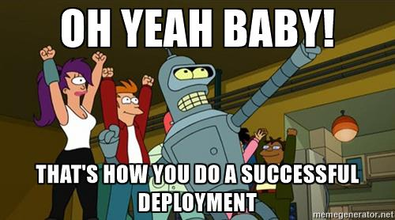

# Release to Production

Here are the steps that release managers performs to deploy code to production (i.e. do a release).

_Note: This assumes that your mass Vagrant VM is already setup and functioning as expected locally. If this is not true, follow the [README](../README.md) to setup your stuff._

1. Check the [GitHub `develop` branch](https://github.com/massgov/mass/commits/develop) to see if there is anything new to deliver. If not, stop here.
1. Check open pull requests.  If any have the label "Config Backport", contact the creator or reviewer and ask them to get it merged right away.  Such PRs represent configuration changes that were made urgently directly in production and if you release without this PR, you will undo the manual configuration change.   Don't proceed until with the release that PR is merged or until the creator works out an alternate understanding with you.
1. If there is new code to be delivered, notify the team at least two hours ahead of time that a release is coming. Follow the [Communicate Releases](https://wiki.state.ma.us/display/massgovredesign/Communicating+Releases) instructions for Upcoming Deployments.
1. Create a release branch (e.g.: `release-0.18.0`) from the GitHub `develop` branch. (Right now, the version is `0.<sprint number>.<number of times deployed within sprint>`. This is not a good long term versioning scheme, but it is what is currently happening today. We should change this.)
1. Add release notes to top of CHANGELOG.md, and then commit.
1. Push your release branch to GitHub (CircleCI will run against your release branch and push it to Acquia Cloud Git for you. However, CircleCI will not push your branch to Acquia Cloud Git if it does not pass automated tests)
1. Wait for CircleCI to run successfully against your release branch. When it is done, it'll push your code to Acquia Git. Note: If the CircleCI run fails, it will not push your code to Acquia Git.
1. Write release notes for all the code being delivered in the release branch. Follow the [Communicate Releases](https://wiki.state.ma.us/display/massgovredesign/Communicating+Releases) instructions for Release Notes. (The release notes will be helpful for the verification steps that will follow. It's suggested that you make a list of all the JIRA tickets that are being delivered; this can help link tickets to the release version via JIRA later.)
1. SSH into the mass Vagrant VM and `cd /var/www/mass.local` or use the alias `www`.
1. Drag the `Database` rectangle from `Prod` into `Stage`.
1. Run `drush ma-deploy test <release branch>` which will perform the following operations on `Stage`: Switch code to this release branch, update the database, load the configuration and clear cache.
1. Verify the release notes against the `Stage` environment. This is a quick smoke test for each new feature/improvement/fix rather than a thorough test.
1. Verify the most critical functionality still works, i.e. smoke test. (Note: This has yet to be defined by the Mass.gov Product Owner. After defined, document this list and include/link-to here.)
1. Open a GitHub Pull Request to merge the release branch into the `master` branch and merge the code.
1. Wait for CircleCI to run successfully against the `master` branch. When it is done, it'll update `master` in Acquia Git. Note: If the CircleCI run fails, it will not push an updated `master` to Acquia Git.
1. In Acquia's git repo, tag `master` with name of this release. We don't tag at Github anymore.
  * use an existing clone or `git clone massgov@svn-20994.prod.hosting.acquia.com:massgov.git massgov-acquia`
  * `cd massgov-acquia`
  * `git checkout master`
  * `git pull`
  * `git tag [release-name]`
  * `git push origin tag [release-name]`
1. Backup the `Prod` database. This can be done from the Acquia Cloud web interface by clicking into the `Prod` environment, then clicking Backup in the Database card.
1. Deploy the release tag to `Prod` by running `drush ma-deploy prod tags/<tag name>`.
1. Type `y` to confirm that you are deploying to production.
1. Login to the mass Vagrant VM and go to `cd /var/www/mass.local`.
1. Run `ma-clear-cache`.
1. Clear the Varnish cache by logging into the Acquia Cloud web interface for the [`massgov (ACE)`](https://cloud.acquia.com/app/develop/applications/ff8ed1de-b8bc-48a4-b316-cd91bfa192c4) application.
1. Click on `Prod`.
1. Click on `Clear Varnish`.
1. Select `All`.
1. Click `Clear`.
1. Do a quick smoke test for a single new feature, improvement, or fix to make sure that `Prod` has the new code.
1. Open a GitHub Pull Request to merge `master` into `develop` (this should only bring an updated deployment ID), and then merge it.
1. In JIRA Go to the [DP project](https://jira.state.ma.us/projects/DP/).
1. Click on the Releases icon on the left side (it looks like a boat/ship).
1. Add a new release version with today's date.
1. Go to each shipped issue and update the `Fix Version/s` field.
1. Go to the list of issues contained within the release version and copy the URL into the release notes just below the `Summary` section.
1. Add your release notes to the [release notes document](https://docs.google.com/document/d/1IWsq4kVqQvUUcVNLvhD5fae0SIgQxKOm5NWbiqaDPIk/edit#heading=h.2oblvp1y124h) per [Communicate Releases](https://wiki.state.ma.us/display/massgovredesign/Communicating+Releases) instructions.
1. Celebrate.

## Rollback

1. Login to the Acquia Cloud web interface within the [`massgov (ACE)`](https://cloud.acquia.com/app/develop/applications/ff8ed1de-b8bc-48a4-b316-cd91bfa192c4) application.
1. Navigate into `Prod`
1. From the Code card, revert to the previously used code tag/branch
1. From the Database card, revert to the backup database created during the release process
1. Notify the team about the rollback per [Communicate Releases](https://wiki.state.ma.us/display/massgovredesign/Communicating+Releases) instructions.
